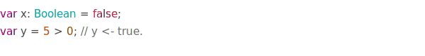
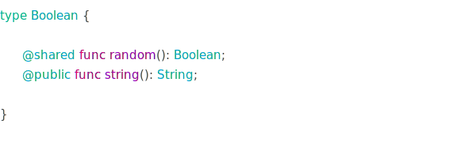
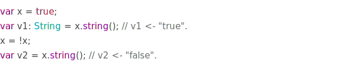

# Boolean Type

The `Boolean` type can be used for logical expression and
it's the only type that can be used to determine
the outcome of a logical statement.
It's value can be either `true` or `false`.

The type can't store integer values.

## Usage

## Prototype

## Methods, Attributes, Properties

### @public func string(): String;

Gets the string representation of the value.\
It returns either `"true"` or `"false"`.

### @shared func random(): Boolean;

Returns a random Boolean value.

