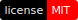
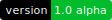

# Stack Language

[](License)
[](ReadMe.md)
[](ReadMe.md#Code-Contributions)

**Stack Programming Language**

High level programming language for *research* and
**Quantum Computing** based on C++, Swift and C#.

This language is also suitable for Biologists,
Engineers, Mathematicians (Libraries in progress)
and hobbyists. We aim to create a powerful language.

The documentation contains the language syntax specification.

- [**Syntax Specification**](Documentation/Syntax/)

## Code Contribution

If you want to contribute you must follow these 
[Conventions](Conventions/) in order to keep the
file structure organized and the code clean.

## Compilation

This code is written in **c++17** so don't try to build
it using an *older version*.

The Compiler must be compiled using *clang++* or *Visual Studio*.
We don't cover support for *gcc* / *g++* and we don't ensure
that our source will be successfully compiled with them.

We recommend using *clang++* on **macOS** and **Linux**
and *Visual Studio Developer Command Prompt* on **Windows**.

The recommended version of *clang++* (**LLVM**) is 8.0.0.
The recommended version of *Visual Studio* is VS2019.

### macOS and Linux Compilation

From the *Terminal* change the current directory to
the Stack project directory.
Execute the following to compile using **clang++**:

``` bash
cd Source
clang++ -o Main Main.cpp -std=c++17
```

This creates a `Main` file in the same folder;
drop it in the console to execute it.

### Windows Compilation

Open up *Visual Studio Developer Command Prompt* and change
the working directory to the Stack project directory.
Execute the following to compile with **cl**:

``` bat
cd Source
cl /EHsc Main.cpp
```

This creates a `Main.obj` and a `Main.exe` file in the
same folder; double click is sufficient to run the code.

In addition you can build the project with **clang++**:

``` bat
cd Source
clang++ -o Main.exe Main.cpp -std=c++17 -Xclang -flto-visibility-public-std
```

Just make sure you have *clang++ LLVM* installed and
added to the environment path.
