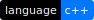
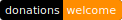

# Spin Language

[](License)
[](ReadMe.md)
[](ReadMe.md)
[](ReadMe.md)
[](https://paypal.me/CristianAntonuccio)

**Spin Programming Language**

High level programming language for *research* in
**Quantum Computing** built in *c++*.

This language is currently *interpreted* but after
a stable release our team will eventually
turn the interpreter into a *virtual machine*.
We aim to create a powerful language.

## A taste of spin

### Numeric Types

``` swift
Integer a = 3 + 2 * 7 - 5;
Integer conversions = 0b10; // binary.
conversions = 0xAB24 * 0o5; // hex + oct.
Real c = 7.7;
Imaginary i = - 7i;
Complex b = 34.6 + 12i + c;
Complex c = a * b - (3.5 + 6i);
```

### Minor Types

``` swift
Bool condition = false;
Byte raw = 0xFF;
raw = ~raw; // bitwise inversion.
String hello = "number " + 10 + '!';
Character exclam = hello[10];
```

### Console Library

Check out the full [**Console Documentation**](Documentation/Libraries/Console.md)

``` swift
import Console;

Console::writeLine("Hello world!");
```

The documentation contains the language syntax specification.

- [**Syntax Specification**](Documentation/)

## Code Contribution

**Attention!** This project is currently under development and
we only completed 70% of the total tasks. We are working on
*class declarations* and *quantum objects*.

**New Contributors are WELCOME**, so if you're a skilled dev
feel free to contact me for joining our team.

If you want to contribute you must follow these 
[Conventions](Conventions/) in order to keep the
file structure organised and the code clean.

## Donations

**Donations** are *welcome*! Offer me a *cup of coffee* since
I drink it *every day* just before working on this project.

[](https://paypal.me/CristianAntonuccio)

## Compilation

This code is written in **c++17** so don't try to build
it using an *older version*.

The Interpreter must be compiled using *clang++*.
We don't cover support for *gcc* / *g++* and we don't ensure
that our source will be successfully compiled with them.

We recommend using *clang++* on **macOS** and **Linux**.

The recommended version of *clang++* (**LLVM**) is 9.0.0.

### Ninja macOS Compilation

If you don't have the small *ninja* build system installed:

``` bash
brew install ninja
```

From the *Terminal* change the current directory to
the Spin Tests directory.
Execute the following to compile using **clang++** (9.0.0):

``` bash
cd Tests
ninja
```

This creates a `ProgTest` file in the same folder;
drop run the following command to execute it.

``` bash
./ProgTest
```
