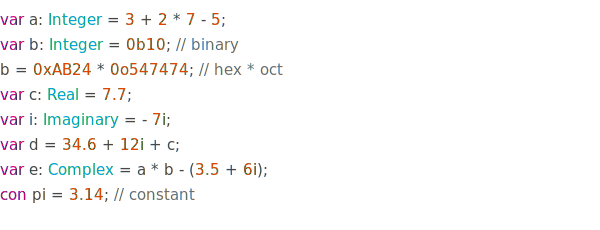
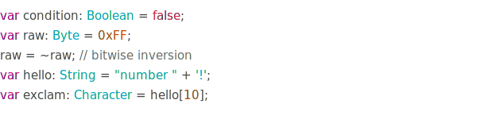

# Spin Language

[](License)
[](ReadMe.md)
[](ReadMe.md)
[](ReadMe.md)
[](https://paypal.me/CristianAntonuccio)

**Spin Programming Language**

High level programming language for *research* in
**Quantum Computing** built in *c++*.

The **Virtual Machine** is almost ready.
We aim to create a powerful language.

The quantum part of the language is not ready yet,
Dirac notation has been implemented in the lexer and
preprocessor, but the **VM** doesn't support it yet.

I'm speeding up the development process since this
will be my thesis.

## A taste of spin

These snippets are here to give you a little background
but if you feel lost when it comes to control flow of the
program, just remember that statements work just like in *c++*.

### Numeric Types



### Minor Types



The documentation contains the language syntax specification.

- [**Syntax Specification**](Documentation/)

## Code Contribution

**Attention!** This project is currently under development and
we only completed 70% of the total tasks. We are now working on
the *Quantum System*.

**New Contributors are WELCOME**, so if you're a skilled dev
feel free to contact me for joining our team.

If you want to contribute you must follow these 
[Conventions](Conventions/) in order to keep the
file structure organised and the code clean.

## Usage / Help

```
% Spin help magician (it's helpful) %
Usage:
    spin <file>
         Compiles and executes a file.
    spin [-compile, -c] <file.spin> <file.sex>
         Compiles a file into a binary.
    spin [-decompile, -d] <file.sex>
         Decompiles a binary file.
    spin [-version, -v]
         Shows the version number.
    .... [-noAnsi, -n]
         Disable ansi output.
  <file>: should be the main file and
          it should end with '.spin' or
          '.sex' if it's a binary file.
  <file.spin>: should be the source file.
  <file.sex>:  should be the binary file.
I told you it was helpful!
```

## Donations

**Donations** are *welcome*! Offer me a *cup of coffee* since
I drink it *every day* just before working on this project.

[](https://paypal.me/CristianAntonuccio)

## Compilation

This code is written in **c++2a** so don't try to build
it using an *older version*.

The **VM** must be compiled using *clang++* and *ninja*.
We don't cover support for *gcc* / *g++* and we don't make
sure that our source will be successfully compiled with them.

We recommend using *clang++* on **macOS** and **Linux**.

The recommended version of *clang++* (**LLVM**) is 9.0.0.
